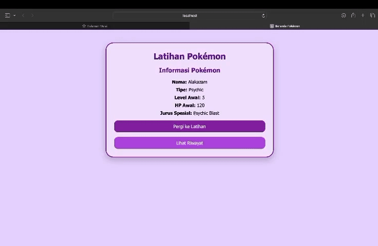

Pokemon Training Simulator

 Data Diri
- Nama Lengkap:Lula Khaisha Delavia
- NIM: H1H024064
- Shift Awal:C
- Shift Akhir: B

-> Penjelasan Singkat Kode dan Aplikasi

Aplikasi ini dibuat untuk melakukan simulasi latihan Pokémon. Fungsinya:
-Menampilkan data Pokémon yang sedang dilatih (misalnya Alakazam).
-Melakukan proses latihan (Attack / Speed / lainnya) dengan intensitas tertentu.
-Meng-update level dan HP Pokémon secara otomatis.
-Menyimpan riwayat latihan ke dalam file riwayat.json.
-Menampilkan riwayat latihan pada halaman Riwayat.php.

Struktur folder meliputi:
1. classes/Pokemon.php
Merupakan class dasar Pokémon.
Memiliki atribut: level, hp, nama.
Pendefinisian method umum (misalnya menambah HP, menaikkan level, dll).
2. classes/Alakazam.php
Inheritance dari Pokemon.
Mempunyai mekanisme latihan sesuai jenis intensitas.
3. latihan.php
Form untuk memilih jenis latihan.
Mengirimkan data ke proses_latihan.php.
4. proses_latihan.php
Mengambil input dari form.
Meng-update level dan HP Pokémon.
Menyimpan hasil ke riwayat.json.
5. Riwayat.php
Membaca file riwayat.json.
Menampilkan daftar riwayat latihan.
6. riwayat.json
Berisi catatan log latihan dalam format JSON.

Cara Menjalankan Aplikasi
1. Pastikan **PHP** sudah terinstal.
2. Clone repository atau download project.
3. Jalankan server lokal di folder project:
    bash
    php -S localhost:9000
  
4. Buka browser:

    http://localhost:8000/index.php
  
5. Gunakan form untuk melatih Pokémon.
6. Riwayat latihan akan otomatis muncul di bagian bawah halaman.

Video / GIF

